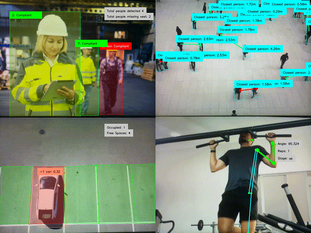
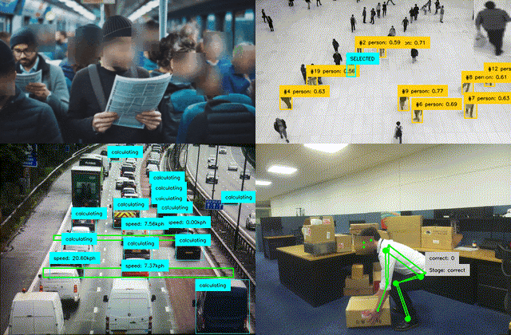

<div align="center">
  <p>
    <a align="center">
      
    </a>
  </p>

</div>

[](https://www.python.org/)
[](https://docs.astral.sh/uv/)

# Introduction 👋
Here we create sample applications using the tools we produce to help the community learn and explore how easy it is to build AI applications around the IMX500 sensor. Where we encourage you to build your own applications and the ideas you have. All Sample Applications are Python based examples built to use the Raspberry PI AI Camera, based on the IMX500 AI image sensor.

# Install 🏗️
Clone the repo and run applications in their directories. All applications are intended to be used in a uv environment and have a pyproject.toml file to install requirements. To install uv:

```bash
curl -LsSf https://astral.sh/uv/install.sh | sh
```
For more information on uv you can read their [documentation](https://docs.astral.sh/uv/getting-started/installation/)

## Application Module Library 
Application Module Library is a Python library that simplifies the development of end-to-end applications for the IMX500 vision sensor. With seamless integration of AITRIOS tools, it helps developers streamline their workflow and focus on what matters most. You can find [Application Module Library Github page](https://github.com/SonySemiconductorSolutions/aitrios-rpi-application-module-library) where you find more documentation on how to build your own applications using the library.

# Sample Applications 💻

<div align="center">
<p align="center">

  Sample Application  | Description | AI Model Type | Model Used 
-------------------- | -----------|--------------------|---------
[Highvis](./examples/highvis) | Detects people and matches them to be wearing safety equipment (PPE). | Object Detection | [Custom NanoDet](https://github.com/SonySemiconductorSolutions/aitrios-rpi-tutorials-ai-model-training/blob/main/notebooks/nanodet-ppe/custom_nanodet.ipynb) 
[Line Monitoring](./examples/line-monitor) | Transforms production line monitoring and object classification, providing a smarter, more efficient way to ensure quality and operational excellence | Classification | [Custom MobilNet](https://github.com/SonySemiconductorSolutions/aitrios-rpi-tutorials-ai-model-training/blob/main/notebooks/mobilenet-rps/custom_mobilenet.ipynb) | 
[Parking Monitoring](./examples/parking-monitor) | Provides real-time data on the availability of parking spaces, displaying the status of each space visually  | Object Detection | [NanoDet Zoo](https://github.com/raspberrypi/imx500-models/blob/main/imx500_network_nanodet_plus_416x416_pp.rpk) 
[Queue Monitoring](./examples/queue-monitor/) |  Track people in queues to help optimize queue management to reduce waiting times and enhance efficiency. | Object Detection | [NanoDet Zoo](https://github.com/raspberrypi/imx500-models/blob/main/imx500_network_nanodet_plus_416x416_pp.rpk) 
[Workout Monitoring](./examples/workout-monitor/) |  Tracks people in real time with keypoints and bboxes to analyse the amount of reps they do in an exercise group. | Pose Estimation | [Posenet](https://github.com/raspberrypi/imx500-models/blob/main/imx500_network_posenet.rpk) 
[Box Lifting](./examples/box-lifting/) |  Tracks people in real time with keypoints and bboxes to analyse if a person if safely picking up heavy objects. | Pose Estimation | [Posenet](https://github.com/raspberrypi/imx500-models/blob/main/imx500_network_posenet.rpk) 
[Nearest Person](./examples/nearest-person/) |  Tracks people in a crowd and calculates the next nearest person. If the nearest person is less than 2 meters away, data can be detected and stored. | Object Detection | [NanoDet Zoo](https://github.com/raspberrypi/imx500-models/blob/main/imx500_network_nanodet_plus_416x416_pp.rpk) 
[People Counting](./examples/people-counting/) |  An essential edge application to count people overtime in across the whole frame or in a selected area.| Object Detection | [SSDMobileNetV2](https://github.com/raspberrypi/imx500-models/blob/main/imx500_network_ssd_mobilenetv2_fpnlite_320x320_pp.rpk)
[Speed Camera](./examples/speed-camera/) |  Detect, track, and calculate the real world speed of objects as they travel through marked areas.| Object Detection | [NanoDet Zoo](https://github.com/raspberrypi/imx500-models/blob/main/imx500_network_nanodet_plus_416x416_pp.rpk) 
[Blur Face](./examples/blur-face/) |  Designed to enhance privacy by blurring the faces of individuals detected in images or video frames in real time. | Pose Estimation | [Posenet](https://github.com/raspberrypi/imx500-models/blob/main/imx500_network_posenet.rpk)
[Motion Sensor](./examples/motion-sensor/) | Application to calculate motion in the image and match it to AI detections to see detections in motion and record/take image of object in motion. | Object Detection | [NanoDet Zoo](https://github.com/raspberrypi/imx500-models/blob/main/imx500_network_nanodet_plus_416x416_pp.rpk)
[Random Person Select](./examples/random-person-select/) | Application to randomly select on person in a crowd and highlight them | Object Detection | [NanoDet Zoo](https://github.com/raspberrypi/imx500-models/blob/main/imx500_network_nanodet_plus_416x416_pp.rpk)
</p>    
</div>

If you wish to use a YOLO Ultralytics model you can get pretrained models and train your own with [Ultralytics](https://docs.ultralytics.com/integrations/sony-imx500/) and convert them for IMX500 and use in our Sample Applications or your own Applications.





## License
IMX500 Sample Applications is licensed under Apache License Version 2.0. By contributing to the project, you agree to the license and copyright terms therein and release your contribution under these terms.

<a href="LICENSE"></a>