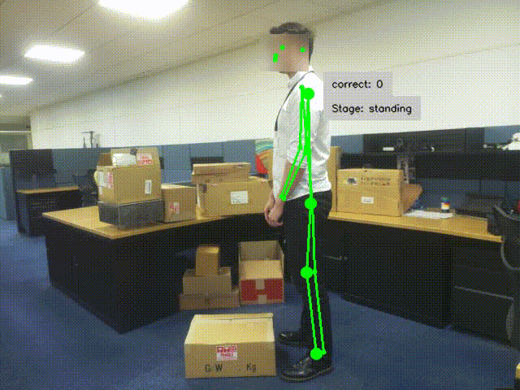

<div align="center">




</div>

<div align="center">

# Box Lifting

</div>

[](https://www.python.org/)
[](https://docs.astral.sh/uv/)


Box lifting, an industrial application that detects the keypoints of observed people and tracks them to monitor if people are lifting heavy objects correctly to prevent injuries. Provide real time information on someone picking up objects so they can correct their posture and store the tracked results to overall analytics. Can be implemented to train people on how to lift objects correctly as well as being used in factories and warehouses to monitor the safety of their works. 

Application's logic works by  monitoring back, leg, and the persons posture to correctly analyse the lift. Application works best when shoulders to feet are visible from a side on view from camera so that the required keypoints are visible.  

## 📦 Installation and Start

Before running the box lifting application ensure you are inside this applications directory

Then using uv to run the application, which will install the pyproject.toml and start the application:
```
uv run app.py
```

### 🧠 Models Used
Model used in this example is Posenet to provide both keypoints to the application. You can get a converted model on Raspberry Pi models [Raspberry Pi Model Zoo](https://github.com/raspberrypi/imx500-models/blob/main/imx500_network_posenet.rpk) for Pose Estimation. 


:warning: **Running a new example with new model for the first time can take a few minutes for the new model to be uploaded.

## License
IMX500 Sample Applications is licensed under Apache License Version 2.0. By contributing to the project, you agree to the license and copyright terms therein and release your contribution under these terms.

<a href="http://www.apache.org/licenses/LICENSE-2.0"></a>
