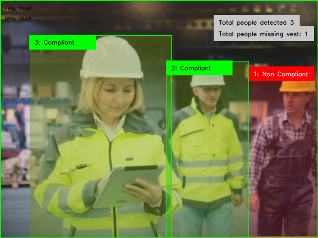

<div align="center">




</div>

<div align="center">

# Highvis

</div>

[](https://www.python.org/)
[](https://docs.astral.sh/uv/)


Matching Overlapping Objects with Robust Filtering.

This demo showcases a system designed to match overlapping objects detected by object detection AI model. It includes filtering mechanisms to ensure objects are not lost even if the AI model struggles detecting the objects over a series of continous frames.
In this particual case the AI model has been trained to detect people and vests.

## Creating a custom NanoDet model to run this example.

To run this example a custom nanodet object detection model has to be trained. The dataset used is the PPE v.3 from RoboFlow.
This link to the tutorial that explains the precedure to train a [nanodet object detector](https://github.com/SonySemiconductorSolutions/aitrios-rpi-tutorials-ai-model-training-dev/blob/master/notebooks/nanodet-ppe/custom_nanodet.ipynb).
Once the model ```nanodet-quant-ppe.keras``` has been created it is time to convert it and package it to be able to run on this platform. The [tutorial](https://developer.aitrios.sony-semicon.com/en/raspberrypi-ai-camera/develop/ai-tutorials/prepare-and-deploy-ai-models-tutorial?version=2024-09-27&progLang=) explains the process to convert ```nanodet-quant-ppe.keras``` to ```network.rpk``` that we can upload to the IMX500.

## 🚀 Installation and Start

Before running the highvis application, in this application's directory you need to create a network folder where the model file and labels.txt are located and can be accessed easily.

```
$ mkdir network
$ cp -v [MODEL_PATH]/model_name.rpk highvis/network
$ cp -v [LABELS_PATH]/labels.txt highvis/network
```

Then create a virtual environment with uv and run the application:
```
# create virtual environment using uv
$ uv venv --system-site-packages

# Installs the pyproject.toml settings and starts the app
$ uv run app.py --model network/model_name.rpk
```

### 🧠 Model Used

- **NanoDet Model**:
  - NanoDet is a FCOS-style one-stage anchor-free object detection model which using Generalized Focal Loss as classification and regression loss.


:warning: **Running a new example with new model for the first time can take a few minutes for the new model to be uploaded.

## 🏛️ Architecture Overview

### Bottom-Up Approach

1. **AI Model (Object Detection)**:
   - Utilizes object detection models such as NanoDet to identify objects.

2. **Output Tensor Transformation**:
   - Converts the output tensors from the AI model to a format which is suitable for the tracker.

3. **Tracker**:
   - Assigns a unique tracker ID to each detected object.
   - Maintains these IDs consistently over time and across frames.

4. **Matcher**:
   - Calculates and identifies which objects are overlapping, the frame ID from the tracker is kept in the cache.

5. **Business Logic Layer**:
   - Computes statistics and provides information about the current state.
   - Tracks the number of people with and without high-visibility vests.


This architecture ensures robust tracking and accurate object matching even in challenging scenarios where objects may overlap or be intermittently lost by the detection model. The combination of advanced detection models, effective tracking, and intelligent filtering makes this system reliable for real-world applications.
