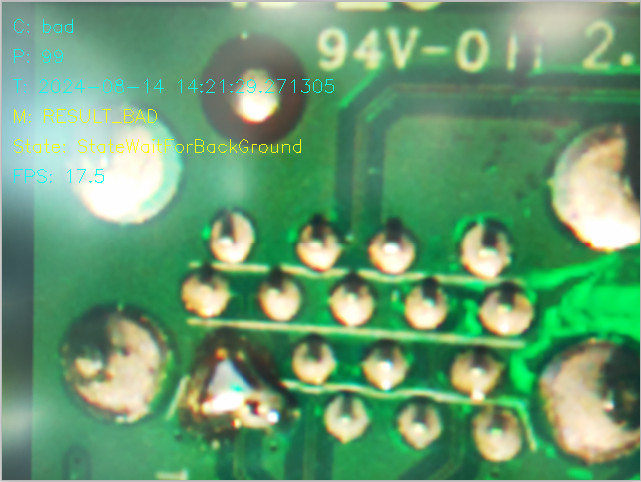

# How to View an Image on the Screen with the AI Camera

## Introduction
This tutorial will guide you through the steps to use the line-monitor application monitoring a videostream of a simulated manufacturing process. 

### Purpose of this document
Since it can be quite difficult to set up a continously occuring process at home to be monitored with the Raspberry Pi AI camera this repository provides a video of rotating table with a couple of Raspberry Pis. The video can then be filmed with the AI camera, the frames will tick the built-in state machine. Depending on what the AI detects the state machine will transition.

The provided classification AI network is trained to detect good or faulty solderpoints of one of the through hole connectors. A version of this software has actually been deployed in the Raspberry Pi factory to monitor this special case. 

## Steps

### Step 1: Prepare the Image
1. Position the camera on a steady mount so that it can view the monitor where the images and video will be displayed.
2. Open one of the images [bad.bmp](assets/bad.bmp) or [good.bmp](assets/good.bmp)
3. Start the line-monitor application, put the camera at a distance so that the image is focused. 
4. Zoom in the image on the computer to make sure you get a good AI detection.
5. Once the setup is stable it is time to roll the video [test.mpg](assets/test.mpg).
6. Zoom in the video so that the format corresonds to the above size in step 4.

#### Expected result

## Conclusion
If the detections is good, you should be able to see the extracted numbers from the line-monitor application in your console.

## Troubleshooting
- **Video not displaying properly:** The video has been tested using [VLC](https://www.videolan.org/vlc/).
- **AI camera not capturing:** Check the connection between the camera and the computer. Make sure the camera drivers are installed.
- **Blurry image:** Adjust the focus and settings on your AI camera for a clearer view.

## Additional Resources
- [AI Camera User Manual](#)
- [Common Image Viewing Software](#)
- [Troubleshooting AI Camera Issues](#)

