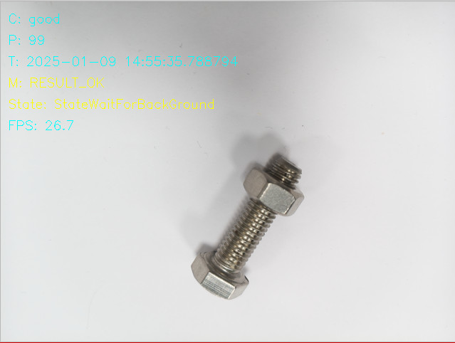

# How to View an Image on the Screen with the AI Camera

## 👋 Introduction
This tutorial will guide you through the steps to use the line-monitor application to monitor a simulated conveyor belt with bolts on.
The provided training data is setup to detect if a nut is present on the bolt.
If no nut is screwed on the bolt it is considered to be incorrectly assembled.

## 🧠 AI Model

If a new custom AI model has been used the AI class label has to be mapped to the internal state machine class label.
This is needed for the internal state machine to understand what the AI class means.
If it is a good or bad part it is processing or if it is observing the background.

> [!IMPORTANT] 
> It is crucial to be able to identify the background to be able to distinguish between parts that are moving along a conveyor belt.
>
>The mappinng is done in the file [\_\_init__.py](fsm/__init__.py).If the file doesn't exist, run this application once and it will be created with default settings.

## 📚 Steps

1. The bolt used in this dataset is an M8x30 material A4 stainless.
2. The height from the lens to the table is 90mm. The background used is a regular white printer paper.
3. Start the application and verify that the AI model correctly classifies the object. (see image below).
4. Move the bold in and out of the cameras field of view to simuilate a conveyor belt. Observe the output in the terminal. Use bolts with and without a nut to get variation in the output.

## Troubleshooting
- **AI camera not capturing:** Check the connection between the camera and the computer. Make sure the camera drivers are installed.
- **Blurry image:** Adjust the focus and settings on your AI camera for a clearer view.
