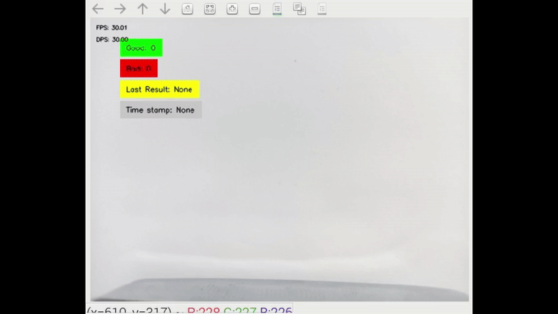

<div align="center">



</div>

<div align="center">

# Line Monitor

</div>

[](https://www.python.org/)
[](https://docs.astral.sh/uv/)

Line-Monitor transforms production line monitoring and object classification, providing a smarter, more efficient way to ensure quality and operational excellence. With its advanced AI-driven analysis, this application is a crucial tool for modern production facilities aiming for high performance and superior quality control.

## 🚀 Installation and Start

### 🧠 Training the Custom Model
This application uses a classification model. To train your own classification model follow our comprehensive Jupyter notebook tutorial that walks you through training a MobileNet classifier model from scratch and converting it for the IMX500 chip in your AI Camera: [Train mobilenet with custom dataset](https://github.com/SonySemiconductorSolutions/aitrios-rpi-tutorials-ai-model-training/blob/main/notebooks/mobilenet-rps/custom_mobilenet.ipynb)

The output from the last step of training and conversion is a quantized model and some files generated during conversion. Use the generated file `packerOut.zip` for the next step.  

#### 📚 Our Dataset
The data set used is provided in the [training_dataset_nuts_and_bolts.zip](./assets/training_dataset_nuts_and_bolts.zip).
The provided dataset is very basic with not too much variation in the images.
The dataset can be extended using the [provided augmentation script](../../tools/dataset-extender/README.md).
This will generate more images with more variation that will in turn render a more general model capable of correctly classifying objects. 


#### 🛠️ Package Model

Once you have your converted model it has to be packaged using the provided tools for the AI Camera, [quick guide on how to package a model](https://developer.aitrios.sony-semicon.com/en/docs/raspberry-pi-ai-camera/imx500-packager?version=2025-09-30&progLang=). However, to convert a model quickly we will use Modlib and upload the model.


### 💻 Run Application
Once the model has been trained, and exported as "Static Classifier" it has to be converted and packaged using the provided tools for the AI Camera.

Before running the line-monitor application you need to create the network folder inside the application's directory
```bash
mkdir network
cp -v [MODEL_PATH]/packerOut.zip line-monitor/network
cp -v [LABELS_PATH]/labels.txt line-monitor/network
```

Then create a virtual environment with uv and run the application:
```bash
uv run app.py
```

:warning: **Running a new example with new model for the first time can take a few minutes for the new model to be uploaded.

<details>
<summary> 👉 For more information on How To </summary>

For a quick how to guide on how to get Line-monitoring working. [HOWTO](./HOWTO.md).
</details>

## **Application Overview:**

The Line-Monitor is an innovative application designed to enhance efficiency and quality control in production environments. Leveraging a robust classification AI model, Line-Monitor analyzes streams of metadata to accurately identify objects passing through a production line. This intelligent system operates seamlessly with a state machine, ensuring precise and real-time analysis of each item.

**Key Features:**

1. **Object Identification and Classification:**
   - **Real-Time Analysis:** The AI model continuously monitors the production line, identifying objects with high accuracy.
   - **Classification:** Each identified object is categorized into predefined classes, ensuring streamlined sorting and processing.

2. **Quality Control:**
   - **Good/Bad Classification:** Objects are inspected and classified as good or bad based on quality criteria.
   - **Fault Detection:** For objects identified as bad, the system further subclassifies the specific type of fault, enabling targeted interventions and quality improvements.

3. **Performance Monitoring:**
   - **Period Measurement:** The application measures the time intervals for objects passing through the line, providing insights into processing speed and efficiency.
   - **Line Availability:** Line-Monitor monitors the production line status, detecting conditions such as blockage or starvation.
   - **Alerts and Notifications:** The system promptly alerts operators about any anomalies, ensuring swift resolution and minimal downtime.

**Benefits:**

- **Enhanced Efficiency:** By automating object identification and fault detection, Line-Monitor reduces the need for manual inspections, speeding up the production process.
- **Improved Quality Control:** Detailed fault classification helps in pinpointing specific issues, allowing for more precise quality management and defect reduction.
- **Real-Time Monitoring:** Continuous monitoring of line availability and performance ensures that production runs smoothly, with quick identification and resolution of any disruptions.

**Use Cases:**

- **Manufacturing:** Ideal for assembly lines, ensuring each product meets quality standards before proceeding to the next stage.
- **Packaging:** Verifies packaging integrity and correctness, classifying defective packages and identifying common issues.
- **Food and Beverage:** Ensures that products are correctly processed and packaged, identifying and categorizing any defects.

## License
IMX500 Sample Applications is licensed under Apache License Version 2.0. By contributing to the project, you agree to the license and copyright terms therein and release your contribution under these terms.

<a href="https://www.apache.org/licenses/LICENSE-2.0"></a>