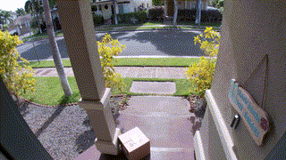

<div align="center">




</div>

<div align="center">

# Motion Sensor

</div>

[](https://www.python.org/)
[](https://docs.astral.sh/uv/)


Motion sensor is an edge application to calculate motion in the image and match it to AI detections to see detections in motion and record/take image of object in motion. Calculates motion by looks at the change in pixels over time and calculates the bboxes of the motion. 

Can be used with an Area to only detect motion/trigger recordings when in an Area. For example, if you only want to detection people approaching your door, mark the Area using pts_selector to help and it won't trigger the save video/image unless in Area. 

There are two versions to run depending on if you want to save images on detection of objects in the area or save a video of objects in motion when detected.

## 🚀 Installation and Start

> [!IMPORTANT] 
> #### App Points Selector
> To change the marked motion areas, edit the example.json to add and edit the point areas or use [app_pts_selector.py](../../tools/pts-selector/) to draw queue areas directly on an image using the cameras view. This app will also normalize the points to use for with application module library. To launch pts_selector:
>```
>python3 app_pts_selector.py --filename example.json
>```
> To use, click the take image button and start drawing the areas you wish to draw. Only supports areas with 4 points. Then Save to json file to keep your changes.
>
>Requirements to run:
>```
>sudo apt-get install python3-pil python3-pil.imagetk
>```

Then using uv to run the application, which will install the pyproject.toml and start the application:
```bash
uv run app.py --json-file example.json --area
```

If you rather record videos instead of capturing images on detection of motion run:
```bash
uv run app_video.py --json-file example.json
```
:warning: **Running a new example with new model for the first time can take a few minutes for the new model to be uploaded.

### 🧠 Models Used

Model used in this example is an Nanodet Object Detection model to provide boundary boxes. You can get a model already converted on [Raspberry Pi's model zoo](https://github.com/raspberrypi/imx500-models/blob/main/imx500_network_nanodet_plus_416x416_pp.rpk) or find other object detection models.

### ⚙️ Changing Settings

Sample Application is configured to look at all objects. To configure it to look at certain objects you can add a class filter to filter by ID  to detect multiple classes. Application needs a .json file to run where you store the x and y coords for the marked motion spaces. Format is shown in example.json provided.

#### 📝 Image Capture Args Options

- `--json-file <path>` _(Required)_: JSON file containing bboxes of Areas 
- `--area  : Toggle on visualization of the Areas

To change the monitored Areas, edit the example.json to add or change the Areas

## License
IMX500 Sample Applications is licensed under Apache License Version 2.0. By contributing to the project, you agree to the license and copyright terms therein and release your contribution under these terms.

<a href="https://www.apache.org/licenses/LICENSE-2.0"></a>

