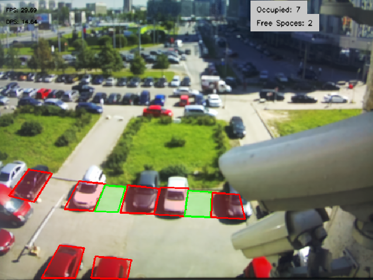

<div align="center">



</div>

<div align="center">

# Parking Monitor

</div>

[](https://www.python.org/)
[](https://docs.astral.sh/uv/)

## Installation

Parking monitor is an application designed to monitor a parking lot using the Raspberry Pi AI Camera system. The application provides real-time data on the availability of parking spaces, displaying the status of each space visually. This project is useful for managing parking spaces, ensuring efficient space utilization, and providing an overview of parking availability.

## 🚀 Installation and Start

Before running the parking_monitor application create a virtual environment inside the application's directory

```
# create virtual environment using uv
$ uv venv --system-site-packages
```

> [!IMPORTANT] 
> #### App Points Selector
>To change the parking spaces, edit the parking-example.json to add and edit the point areas or use app_pts_selector.py to draw parking spaces directly on an image using the cameras view. This app will also normalize the points to use for with application module library. To launch pts_selector:
>```
>uv run app_pts_selector.py --filename parking_example.json
>```
>To use, click the take image button and start drawing the spaces you wish to draw. Only supports spaces with 4 points. Then Save to json file to keep your changes.
>
>Requirments to run:
>```
>sudo apt-get install python3-pil python3-pil.imagetk
>```

Then to run the application:
```
# Installs the pyproject.toml settings and starts the app
$ uv run app.py --json-file parking_example.json
```

### 🧠 Models Used

Model used in this example is an Nanodet Object Detection model to provide boundary boxes. You can use a model already converted on [Rasberry Pi's model zoo](https://github.com/raspberrypi/imx500-models/blob/main/imx500_network_nanodet_plus_416x416_pp.rpk) or use other object detection models.

### ⚙️ Changing Settings

Sample Application is configured to look at vehicles, however to configure it to look at other object you can change the class ID or add multiple to detect multiple classes in a queue. Application needs a .json file to run where you store the x and y coords for the parking spaces. Format is shown in parking-example.json provided.

#### 📝 Parking-Monitor Args Options
```
--json-file                        Json file containing bboxes of parking spaces                   [required]
```
## 🎨 Features

- **Real-Time Monitoring**: Continuously analyzes the parking lot to detect occupied and free parking spaces.
- **Visual Feedback**: Displays a live feed with bounding boxes:
  -  **Green**: Free parking space.
  - **Red**: Occupied parking space.
- **Scalable**: Can be adapted for parking lots of various sizes.


:warning: **Running a new example with new model for the first time can take a few minutes for the new model to be uploaded.


