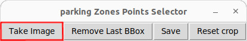

# AI Parking-Monitor


## Installation and start
Create a venv (virtual environment) with:
```
$ python3 -m venv venv --system-site-packages
$ source venv/bin/activate
$ pip install -e [PATH_TO_THIS_REPO]
```

Start app:
```
$ parking-monitor --model [PATH_TO_MODEL]/imx500_network_yolov8n.rpk
```
:warning: **Running a new example with new model for the first time can take a few minutes for the new model to be uploaded.

## Overview

**AI-Parking-Monitor** is an application designed to monitor a parking lot using the Raspberry pi AI-camera system. The application provides real-time data on the availability of parking spaces, displaying the status of each space visually and in a machine-readable JSON format. This project is useful for managing parking spaces, ensuring efficient space utilization, and providing an overview of parking availability.

## Features

- **Real-Time Monitoring**: Continuously analyzes the parking lot to detect occupied and free parking spaces.
- **Visual Feedback**: Displays a live feed with bounding boxes:
  - **Green**: Free parking space.
  - **Red**: Occupied parking space.
- **JSON Output**: Generates a JSON object that lists the status of all parking spaces in real time.
- **Scalable**: Can be adapted for parking lots of various sizes.

## Setup

### Defining the parking slots


1. Start the point selector application:
```
$ parking-pts-selector
```

2. First one window with the camera image is shown. Press the button "Take Image" to fetch a static image.
)


3. In the fetched image, right click in the top left then right bottom corner to define your digital zoom area.
4. Click "Take Image" again to fetch a new static image with the new zoom setting.
5. Now left click, (4 clicks) per parking slot to define each parkings slot.
6. Once this is done, click save. You can now start the app using [AI ParkingLot-Monitor](#Installation and start)