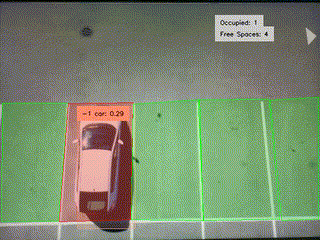

<div align="center">



</div>

<div align="center">

# Parking Monitor

</div>

[](https://www.python.org/)
[](https://docs.astral.sh/uv/)

## Installation

Parking monitor is an application designed to monitor a parking lot using the Raspberry Pi AI Camera system. The application provides real-time data on the availability of parking spaces, displaying the status of each space visually. This project is useful for managing parking spaces, ensuring efficient space utilization, and providing an overview of parking availability.

## 🚀 Installation and Start

Before running the parking_monitor application, ensure you are inside this applications directory.

> [!IMPORTANT] 
> #### App Points Selector
>To change the parking spaces, edit the areas.json to add and edit the point areas or use [app_pts_selector](../../tools/pts-selector/) or our new add on to edit the points in the app with [Configuration](../../tools/configurator/) to draw parking spaces directly on an image using the cameras view. These apps will also normalize the points to use for with Application Module Library.
>To start using the in app Configuration tool, click the mouse wheel. 

Then using uv to run the application, which will install the pyproject.toml and start the application:

```bash
uv run app.py 
```

### 🧠 Models Used

Model used in this example is an Nanodet Object Detection model to provide boundary boxes. You can use a model already converted on [Raspberry Pi's model zoo](https://github.com/raspberrypi/imx500-models/blob/main/imx500_network_nanodet_plus_416x416_pp.rpk) or use other object detection models.

### ⚙️ Changing Settings

Sample Application is configured to look at vehicles, however to configure it to look at other object you can change the class ID or add multiple to detect multiple classes in a queue. Application needs a .json file to run where you store the x and y coords for the parking spaces. Format is shown in areas.json provided.

#### 📝 Parking-Monitor Args Options

`--roi_input <ROI>`     _(optional)_ : Set input tensor ROI

## 🎨 Features

- **Real-Time Monitoring**: Continuously analyzes the parking lot to detect occupied and free parking spaces.
- **Visual Feedback**: Displays a live feed with bounding boxes:
  -  **Green**: Free parking space.
  - **Red**: Occupied parking space.
- **Scalable**: Can be adapted for parking lots of various sizes.


:warning: **Running a new example with new model for the first time can take a few minutes for the new model to be uploaded.

## License
IMX500 Sample Applications is licensed under Apache License Version 2.0. By contributing to the project, you agree to the license and copyright terms therein and release your contribution under these terms.

<a href="https://www.apache.org/licenses/LICENSE-2.0"></a>

