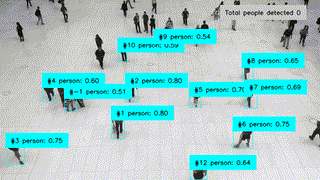
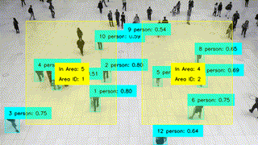

<div align="center" style={{display: 'flex', gap: '20px'}}>
    <div style={{flex: 1}}>
        
        
    </div>
</div>


<div align="center">

# People Counting

</div>

[](https://www.python.org/)
[](https://docs.astral.sh/uv/)


People counting application provides an essential edge application to count people overtime in across the whole frame or in a selected area. Can be combined with other modules in Application Module Library like Blur, to mask people's faces, or you can capture an Image or Video on detection of person. 


## 🚀 Installation and Start


To run the application using uv, which will install the pyproject.toml and start the application:
```bash
uv run app.py
```

Or if you want to run the application with areas:

> [!IMPORTANT] 
> #### App Points Selector
> To change the monitored areas, edit the example.json to add and edit the point areas or use [app_pts_selector.py](../../tools/pts-selector/) to draw queue areas directly on an image using the cameras view. This app will also normalize the points to use for with application module library. To launch pts_selector:
>```
>$ python3 app_pts_selector.py --filename example.json
>```
> To use, click the take image button and start drawing the areas you wish to draw. Only supports areas with 4 points. Then Save to json file to keep your changes.
>
>Requirements to run:
>```
>sudo apt-get install python3-pil python3-pil.imagetk
>```

Then to run the application with areas:
```bash
uv run app-area.py --json-file example.json
```

### 🧠 Models Used
Model used in this example is SSDMobileNetV2FPNLite320x320 Model to provide boundary boxes to the application. But can be easily used with other Object Detection models

#### 📝 Nearest Person Area Args Options

`--json-file <path>`     _(required)_ : Path to json file with areas to check

:warning: **Running a new example with new model for the first time can take a few minutes for the new model to be uploaded.

## License
IMX500 Sample Applications is licensed under Apache License Version 2.0. By contributing to the project, you agree to the license and copyright terms therein and release your contribution under these terms.

<a href="https://www.apache.org/licenses/LICENSE-2.0"></a>
