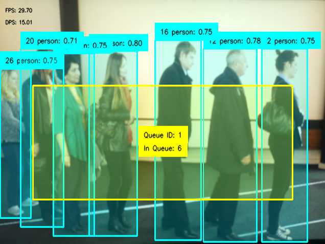

<div align="center">



</div>

<div align="center">

# Queue Monitor

</div>


[](https://www.python.org/)
[](https://docs.astral.sh/uv/)


Queue Monitor is an edge application to track people in queues to help optimize queue management to reduce waiting times and enhance efficiency. Uses Object Detection and can be applied in retail, airports, and banks, and can also be used to analyze car traffic queues to help reduce traffic congestion in real time.

## 🚀 Installation and Start

Before running the parking_monitor application create a virtual environment inside the application's directory

```
# create virtual environment using uv
$ uv venv --system-site-packages
```
> [!IMPORTANT] 
> #### App Points Selector
> To change the queue areas, edit the example.json to add and edit the point areas or use app_pts_selector.py to draw queue areas directly on an image using the cameras view. This app will also normalize the points to use for with application module library. To launch pts_selector:
>```
>$ uv run app_pts_selector.py --filename example.json
>```
> To use, click the take image button and start drawing the areas you wish to draw. Only supports areas with 4 points. Then Save to json file to keep your changes.
>
>Requirments to run:
>```
>sudo apt-get install python3-pil python3-pil.imagetk
>```

Then to run the application:
```
# Installs the pyproject.toml settings and starts the app
$ uv run app.py --json-file example.json
```

### 🧠 Models Used

Model used in this example is an Nanodet Object Detection model to provide boundary boxes. You can get a model already converted on [Rasberry Pi's model zoo](https://github.com/raspberrypi/imx500-models/blob/main/imx500_network_nanodet_plus_416x416_pp.rpk) or find other object detection models.

### ⚙️ Changing Settings

Sample Application is configured to look at people, however to configure it to look at other object you can change the class ID or add multiple to detect multiple classes in a queue. Application needs a .json file to run where you store the x and y coords for the queue spaces. Format is shown in example.json provided.

#### 📝 Queue Monitor Args Options
```
--json-file                        Json file containing bboxes of queues                   [required]
```
:warning: **Running a new example with new model for the first time can take a few minutes for the new model to be uploaded.

To change the queue spaces, edit the example.json to add and edit the queue areas

:warning: **Running a new example with new model for the first time can take a few minutes for the new model to be uploaded.

