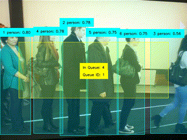

<div align="center">



</div>

<div align="center">

# Queue Monitor

</div>


[](https://www.python.org/)
[](https://docs.astral.sh/uv/)


Queue Monitor is an edge application to track people in queues to help optimize queue management to reduce waiting times and enhance efficiency. Uses Object Detection and can be applied in retail, airports, and banks, and can also be used to analyze car traffic queues to help reduce traffic congestion in real time.

## 🚀 Installation and Start

Before running the queue_monitor application, ensure you are inside this applications directory

> [!IMPORTANT] 
> #### App Points Selector
>To change the quere areas, edit the areas.json to add and edit the point areas or use [app_pts_selector](../../tools/pts-selector/) or our new add on to edit the points in the app with [Configuration](../../tools/configurator/) to draw queue areas directly on the frame using the cameras view. These apps will also normalize the points to use for with Application Module Library.
>To start using the in app Configuration tool, click the mouse wheel. 
Then using uv to run the application, which will install the pyproject.toml and start the application:

```bash
uv run app.py 
```

### 🧠 Models Used

Model used in this example is an Nanodet Object Detection model to provide boundary boxes. You can get a model already converted on [Raspberry Pi's model zoo](https://github.com/raspberrypi/imx500-models/blob/main/imx500_network_nanodet_plus_416x416_pp.rpk) or find other object detection models.

### ⚙️ Changing Settings

Sample Application is configured to look at people, however to configure it to look at other object you can change the class ID or add multiple to detect multiple classes in a queue. Application needs a .json file to run where you store the x and y coords for the queue spaces. Format is shown in areas.json provided.

#### 📝 Queue Monitor Args Options

`--roi_input <ROI>`     _(optional)_ : Set input tensor ROI

:warning: **Running a new example with new model for the first time can take a few minutes for the new model to be uploaded.

To change the queue spaces, edit the example.json to add and edit the queue areas

## License
IMX500 Sample Applications is licensed under Apache License Version 2.0. By contributing to the project, you agree to the license and copyright terms therein and release your contribution under these terms.

<a href="https://www.apache.org/licenses/LICENSE-2.0"></a>

