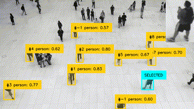

<div align="center">




</div>

<div align="center">

# Random Person Select

</div>

[](https://www.python.org/)
[](https://docs.astral.sh/uv/)


Random Person Select is an edge AI application designed to analyze video frames in real-time. It identifies individuals within a given frame using object detection models, selects one person at random, and isolates their bounding box. The application then crops the selected person's bounding box and dynamically displays it in the top-right corner of the frame, providing a seamless and efficient visual representation of the chosen individual.


## 🚀 Installation and Start

Before running the random-person-select application, make sure you are inside the application's directory.

Then using uv to run the application, which will install the pyproject.toml and start the application:
```
uv run app.py
```
:warning: **Running a new example with new model for the first time can take a few minutes for the new model to be uploaded.

### 🧠 Models Used
Model used in this example is NanoDetPlus416x416 Model to provide boundary boxes to the application. You can get a converted model on Raspberry Pi models [Raspberry Pi Model Zoo](https://github.com/raspberrypi/imx500-models/blob/main/imx500_network_nanodet_plus_416x416.rpk).


## License
IMX500 Sample Applications is licensed under Apache License Version 2.0. By contributing to the project, you agree to the license and copyright terms therein and release your contribution under these terms.

<a href="https://www.apache.org/licenses/LICENSE-2.0"></a>
