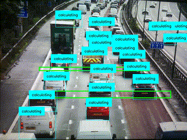

<div align="center">



</div>

<div align="center">

# Speed Camera

</div>


[](https://www.python.org/)
[](https://docs.astral.sh/uv/)


Speed Camera is an edge application to detect, track, and calculate the real world speed of objects as they travel through marked areas. Can be applied to analyze motorway speed limits, sport statistics like running speed and ball speed in real time. 

To increase the accuracy of the speed calculations, use our 3D_calibration tool to help mark your areas for monitoring. Then mark an object of know size in the area and input it's size in meters in the entry box.

## 🚀 Installation and Start

> [!IMPORTANT] 
> #### 3D Calibration
> To change the speed areas, edit the example.json to add and edit the areas and the distance per pixel values assigned to those areas. Or use [3D_calibration.py](../../tools/3D-calibration/) to draw the speed areas directly on a taken image and measure a object of known size in the area to calculate the distance per pixel values. To launch 3D_calibration:
>```bash
>python3 3D_calibration.py --filename example.json
>```
> To use, click the take image button and start drawing the areas you wish to draw by clicking on image, 2 clicks draws a bbox area. Then click twice on an object of know size in the marked area, where the two points of the clicks are the size of the object. Then for the number of areas you have drawn, enter the size of the marked objects (in meters) in the entry box with spaces to separate values if there are multiple areas. 
>
>Requirements to run:
>```bash
>sudo apt-get install python3-pil python3-pil.imagetk
>```

Before running the speed camera application ensure you are inside this applications directory

Then using uv to run the application, which will install the pyproject.toml and start the application:
```bash
uv run app.py  --json-file example.json
```

### 🧠 Models Used

Model used in this example is an Nanodet Object Detection model to provide boundary boxes. You can get a model already converted on [Raspberry Pi's model zoo](https://github.com/raspberrypi/imx500-models/blob/main/imx500_network_nanodet_plus_416x416_pp.rpk)  or find other object detection models.

### ⚙️ Changing Settings

Sample Application is configured to look at cars, however to configure it to look at other object you can change the class ID or add multiple to detect multiple classes in an area. Application needs a .json file to run where you store the x and y coords for the marked speed areas. Format is shown in example.json provided.

#### 📝 Speed Camera Args Options
```
--json-file                 Json file containing bboxes of speed areas                  [required]
```
:warning: **Running a new example with new model for the first time can take a few minutes for the new model to be uploaded.

## License
IMX500 Sample Applications is licensed under Apache License Version 2.0. By contributing to the project, you agree to the license and copyright terms therein and release your contribution under these terms.

<a href="https://www.apache.org/licenses/LICENSE-2.0"></a>
