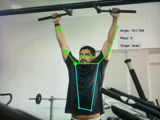

<div align="center">




</div>

<div align="center">

# Workout Monitor

</div>

[](https://www.python.org/)
[](https://docs.astral.sh/uv/)


Workout Monitoring, An edge application that tracks people in real time with keypoints and bboxes to analyse the amount of reps they do in an exercise group. Providing feedback on the users workout to make better informed decisions and optimize performance during the workout to prevent injuries. 

Type of workout poses to detect **pullup, pushup, abworkout, squat** and can change between the different workout types when starting the application.  

## 🚀 Installation and Start

Before running the workout-monitor application, ensure you are inside this applications directory

Then using uv to run the application, which will install the pyproject.toml and start the application:
```
uv run app.py --exercise squat
```

### 🧠 Models Used
Model used in this example is Posenet Model to provide both boundary boxes and keypoints to the application. You can get a converted model on Raspberry Pi models [Raspberry Pi Model Zoo](https://github.com/raspberrypi/imx500-models/blob/main/imx500_network_posenet.rpk) for Pose Estimation.

### 📝 Args Options

`--exercise <exercise>` _(optional)_ : Type of exercise to monitor. Options: [pullup, pushup, abworkout, squat]     

:warning: **Running a new example with new model for the first time can take a few minutes for the new model to be uploaded.

## License
IMX500 Sample Applications is licensed under Apache License Version 2.0. By contributing to the project, you agree to the license and copyright terms therein and release your contribution under these terms.

<a href="https://www.apache.org/licenses/LICENSE-2.0"></a>